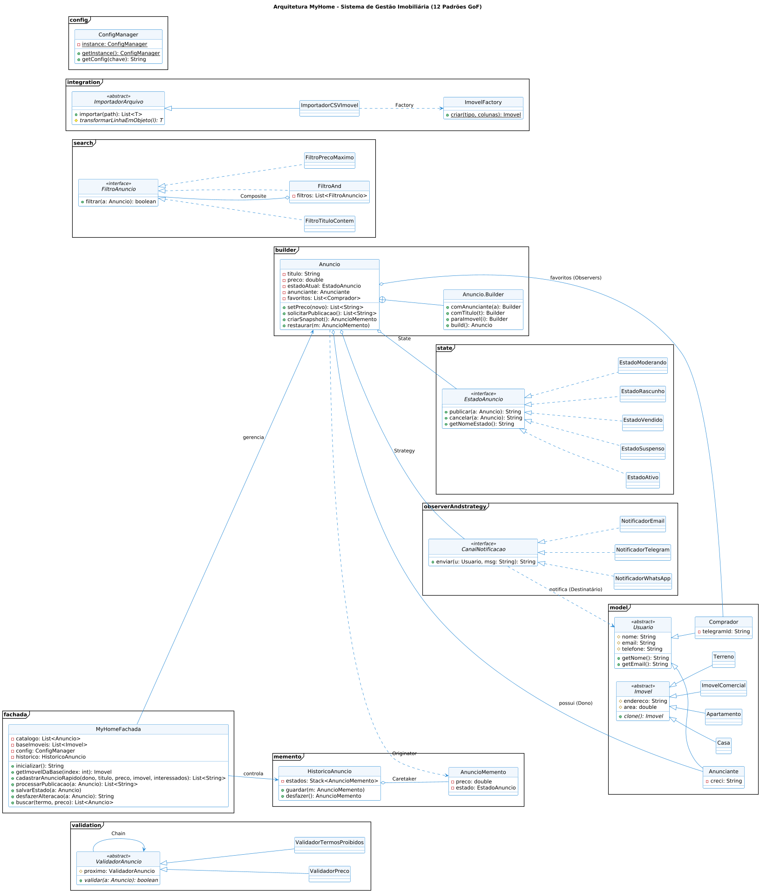

# MyHome - Plataforma de Classificados Imobiliários

### 🎓 Informações Acadêmicas
* **Instituição:** Instituto Federal da Paraíba (IFPB) - Campus João Pessoa
* **Curso:** Tecnologia em Sistemas para Internet
* **Disciplina:** Padrões de Projeto de Software
* **Período:** 5º Período
* **Professor:** Alex Sandro da Cunha Rêgo
* **Estudante:** Felipe de Brito, Joana Elise

---

## 🏗️ Arquitetura do Sistema
Abaixo, o diagrama de classes detalha a estrutura do MyHome, destacando a implementação dos padrões criacionais, estruturais e comportamentais para garantir a fidelidade ao domínio solicitada:
<p align="center">
  
  <br>
  <em>Figura 1: Arquitetura Técnica e Padrões de Projeto aplicados ao MyHome.</em>
</p>

## 📂 Estrutura do Projeto

```text
MyHome/
├── .git/
├── .github/
│   └── appmod/
│       └── appcat/
├── bin/                       # Arquivos compilados (.class)
├── config.properties          # Configurações de negócio e chaves de API
├── diagrama.png               # Diagrama de Classes UML
├── imoveis.csv                # Base de dados para importação
├── Main.java                  # Classe principal e demonstração
├── README.md                  # Documentação do projeto
└── src/                       # Código-fonte
    ├── builder/
    │   └── Anuncio.java
    ├── config/
    │   └── ConfigManager.java
    ├── fachada/
    │   └── MyHomeFachada.java
    ├── integration/           
    │   ├── CriadorImovel.java
    │   ├── ImovelFactory.java
    │   ├── ImportadorArquivo.java
    │   └── ImportadorCSVImovel.java
    ├── memento/              
    │   ├── AnuncioMemento.java
    │   └── HistoricoAnuncio.java
    ├── model/                
    │   ├── Anunciante.java
    │   ├── Comprador.java
    │   ├── Usuario.java
    │   ├── Imovel.java
    │   ├── Casa.java
    │   ├── Apartamento.java
    │   ├── ImovelComercial.java
    │   └── Terreno.java
    ├── observerAndstrategy/   
    │   ├── CanalNotificacao.java
    │   ├── NotificadorEmail.java
    │   ├── NotificadorTelegram.java
    │   └── NotificadorWhatsApp.java
    ├── search/                
    │   ├── FiltroAnuncio.java
    │   ├── FiltroComposto.java
    │   ├── FiltroPrecoMaximo.java
    │   └── FiltroTitulo.java
    ├── state/                
    │   ├── EstadoAnuncio.java
    │   ├── EstadoAtivo.java
    │   ├── EstadoModerando.java
    │   ├── EstadoRascunho.java
    │   ├── EstadoSuspenso.java
    │   └── EstadoVendido.java
    └── validation/            
        ├── ValidadorAnuncio.java
        ├── ValidadorPreco.java
        └── ValidadorTermosProibidos.java
```

## 🚀 1. Descrição da Solução
O **MyHome** é um ecossistema robusto para classificados de imóveis, desenvolvido em **Java Puro (Java SE)**, sem a dependência de frameworks externos. A solução foca em extensibilidade e desacoplamento, permitindo que novos tipos de imóveis, métodos de validação e canais de comunicação sejam adicionados sem a necessidade de modificar o núcleo do sistema (Princípio Aberto/Fechado).

A arquitetura foi desenhada para suportar fluxos complexos de moderação, buscas dinâmicas com lógica booleana e persistência de estado (Undo/Redo), garantindo que a plataforma seja escalável e de fácil manutenção.

---

## 🛠️ 2. Padrões de Projeto Utilizados

| Padrão | Pacote / Localização | Finalidade no Projeto |
| :--- | :--- | :--- |
| **Singleton** | `config/ConfigManager.java` | Garante uma única instância para o carregamento e acesso global ao arquivo `config.properties`. |
| **Builder** | `builder/Anuncio.java` | Facilita a criação guiada de anúncios complexos, garantindo que o objeto só seja instanciado se possuir os dados obrigatórios. |
| **Prototype** | `model/Imovel.java` | Permite a clonagem eficiente de modelos de imóveis carregados da base CSV para a criação de novos anúncios. |
| **Factory Method** | `integration/ImovelFactory.java` | Centraliza a criação de diferentes tipos de imóveis (Casa, Apto, Terreno, Comercial) utilizando um **Registry Map**, eliminando `if/else` excessivos. |
| **Facade** | `fachada/MyHomeFachada.java` | Oferece uma interface simplificada que orquestra os subsistemas complexos (Builder, State, Observer) para a classe `Main`. |
| **Template Method** | `integration/ImportadorArquivo.java` | Define a estrutura fixa do algoritmo de importação de arquivos, delegando o processamento específico de cada linha para as subclasses. |
| **State** | `state/` | Gerencia o ciclo de vida do anúncio (Rascunho, Moderando, Ativo, Suspenso, Vendido), isolando a lógica de transição em classes próprias. |
| **Chain of Responsibility** | `validation/` | Implementa uma esteira de validação automática. O anúncio percorre uma corrente de validadores (Preço, Termos Proibidos) antes de ser publicado. |
| **Observer** | `observerAndstrategy/` | O Anúncio (Subject) notifica automaticamente os canais de comunicação sobre mudanças de estado ou eventos relevantes. |
| **Strategy** | `observerAndstrategy/` | Permite alternar dinamicamente o meio de envio das notificações (Telegram, E-mail, WhatsApp) através de uma interface comum. |
| **Composite** | `search/` | Provê um mecanismo de busca avançada onde filtros (Preço, Título) são tratados como objetos e podem ser combinados (AND). |
| **Memento** | `memento/` | Captura e restaura o estado interno do anúncio, habilitando a funcionalidade de "Desfazer" (Undo) durante a edição. |
---

## 📋 3. Especificação dos Requisitos Resolvidos

### Requisitos Funcionais (RF)
* **RF01 (Criação Guiada):** Uso do padrão **Builder** para garantir a construção de anúncios íntegros, exigindo título, preço, anunciante e imóvel.
* **RF02 (Modelos Padrão):** Implementado via padrão **Prototype** no pacote `model`, permitindo a clonagem de protótipos de imóveis carregados da base CSV sem novas leituras de disco.
* **RF03 (Moderação Automática):** Utilização de **Chain of Responsibility** para validar anúncios contra uma lista de termos proibidos e faixas de preço parametrizadas.
* **RF04 (Estados do Anúncio):** Máquina de estados (**State**) que gerencia o ciclo de vida (Rascunho, Moderando, Ativo, Suspenso, Vendido) e restringe ações de acordo com o estado atual.
* **RF05 (Notificações):** Estrutura de **Observer + Strategy** para notificar múltiplos interessados via Telegram, E-mail e WhatsApp de forma desacoplada.
* **RF06 (Busca Avançada):** Padrão **Composite** para compor filtros dinâmicos (Título, Preço) de forma recursiva, permitindo consultas complexas.
* **RF07 (Configuração Centralizada):** Uso de **Singleton** para garantir que o `ConfigManager` gerencie o acesso global ao arquivo `config.properties`.
* **RF08 (Histórico/Undo):** Implementação de **Memento** que captura snapshots do anúncio, permitindo a restauração de estados anteriores (Undo).

### Requisitos Estruturais (E)
* **E1 (Carga de Dados):** Importação extensível de arquivos CSV através de **Template Method**.
* **E2 (Domínio Silencioso e Desacoplado):** Para cumprir a exigência de evitar `System.out.println` nas classes de lógica, o sistema utiliza o retorno de listas de mensagens (`List<String>`). Toda a comunicação de estado e eventos é gerada no domínio, orquestrada pela `MyHomeFachada` e exibida exclusivamente pela classe `Main`, garantindo que o núcleo do sistema seja independente de interface.

---

## 💡 4. Originalidade e Diferenciais Técnicos

1. **Registry-Based Factory (Diferencial de Código):** Ao contrário de implementações tradicionais com longas estruturas de if/else, o ImovelFactory utiliza um mapeamento funcional (Map). Isso torna o sistema "Plug & Play", permitindo adicionar novos tipos de imóveis (como 'Galpão' ou 'Chácara') com apenas uma linha de configuração, sem alterar a lógica de importação.


2. **Mecanismo de Tolerância a Falhas (RF08 - Memento):** Implementamos um sistema de Undo/Redo (Desfazer/Refazer) para a edição de anúncios no estado de Rascunho. Isso permite que o anunciante recupere versões anteriores de um anúncio após edições acidentais, garantindo a integridade dos dados antes da submissão para moderação.

---

## 🏃 5. Como Executar o Projeto

### Pré-requisitos
* Java JDK 17 ou superior.
* Arquivos `config.properties` e `imoveis.csv` localizados na raiz do projeto.

### Instruções
1.  Abra o terminal na pasta raiz do projeto.
2.  Compile todas as classes:
    ```bash
    javac -d bin (Get-ChildItem -Recurse *.java).FullName
    ```
3.  Execute a aplicação:
    ```bash
    java -cp bin Main
    ```

---
